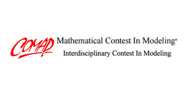

# MCM_2022

<figure class="image">
    
</figure>

Authors: [Junyang Cai](https://github.com/caidog1129), [Tianzhu Liu](https://github.com/peterliu0104), [Ding Zhang](https://github.com/PeanutButter6488)

Group ID: 2227115

This repo contains the solution for the Mathematical Contest in Modeling (MCM) 2022, Problem C: Trading Strategies. 
